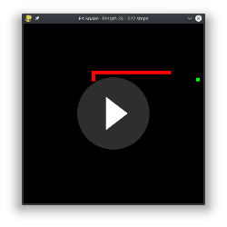
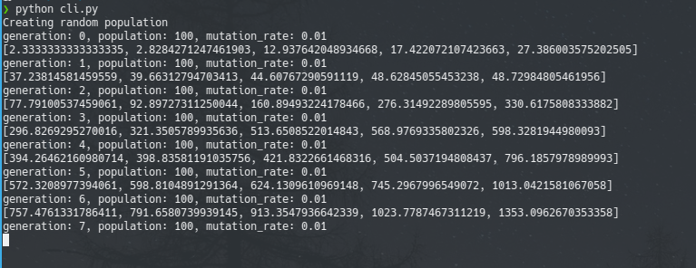
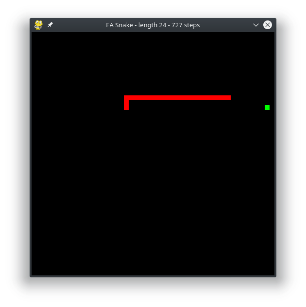
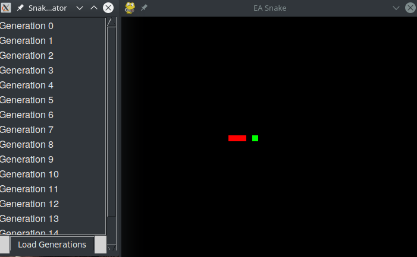

# Evolutionary Algorithm applied to the Snake Game

This project was founded at [Ferienakademie](https://www.ferienakademie.de/) 2019 by [Magnus Kühn](https://github.com/MeinAccount/), [Tobias Jülg](https://github.com/JobiProGrammer)
and [Paul Andrei Sava](https://github.com/Ancris1337), three members of [Course 1 "Modern Algorithmic: Randomised, Online, Approximative"](https://www.cs12.tf.fau.de/veranstaltungen/ferienakademie-sarntal-2019/).

Since we had a presentation about evolutionary algorithms in that course, we decided to put our learned
knowledge into practice by developing a neural network that learns to play the game of snake by pure
evolution. [Video of an example run:](images/example_run.mp4)

<p align="center">
    <a href="images/example_run.mp4?raw=true"></a>
</p>

## Idea

The basic Idea is that in each step we use a neural network to decide which turn the snake should do next.
This network has only one hidden layer with 100 neurons, four input features and 3 output features.

The four input features consist of bool list of whether the three neighbours are empty or not (snake tail or wall)
and the angle of the food relative to the snakes head (Evenly distributed between -1 and 1, 0 means the food is straight ahead).

The three output neurons represent the direction the network wants to go in the next step: left, ahead or right.
For the decision the strongest neuron will be taken (argmax). In between the layers we use a ReLu activation function and no bias.

With this setting we come to `4*100 + 100*3 = 700` weights for our fully connected network.
These weights are set to random in the beginning and therefore have to be trained. But instead of using
gradient decent we are using an evolutionary approach which work as follows:

1. First, we create a population, a set of solutions, at random. So in our case we initialise a bunch
of networks with random weights
2. Test the how well the population performs by giving each individual a fitness score. In our case we
run a simulation for each individual and see how far it comes until the game is over. We tried to include how much steps it took to reach the food and so on.
This fitness function is not straight forward and usually needs to be specifically designed for the problem.
Since this will be how we value each solution.
3. Evolution:
* Take the best x percent of individuals and produce offspring by combing their DNA (our network weights) at random: Create a new individual by randomly selecting the weights form either parent A or B.
* Mutate the offspring at random: each weight has the same normally low chance to be freshly chosen at random.
* Combine the Offspring with the best parents to have the same size as before.

This is one generation, to start the next one, we start again at step 2. One can terminate the process when there is no more real improvement noticeable.

Speaking on a high level, this is a optimisation process and evolution is one method to find a local optima for the problem. Therefore, we can see that this must converge at some point. 
## Installation

Cloning the repository and setting up the virtual environment
```shell script
git clone git@github.com:MeinAccount/ea-snake.git
cd ea-snake
# virtualenv might need to be installed. F.e. on debian based: 'sudo apt install virtualenv'
virtualenv --python=python3.6 venv
source venv/bin/activate
# to deactivate virtualenv use 'deactivate'
pip install -r requirements.txt
```

## Usage

There are three runnable python files in the project's main folder:
* `cli.py`
* `render.py`
* `evolution_render.py`

### `cli.py`
`cli.py` is a commandline tool which allows you to run an evolution simulation. You can pass the following arguments:
```shell script
usage: cli.py [-h] [-g LOAD_GEN] [-f LOAD_FILE] [-s SELECTION_RATE]
              [-m MUTATION_RATE] [-p POPULATION_SIZE] [-sm SAVE_MODE]

optional arguments:
  -h, --help            show this help message and exit
  -g LOAD_GEN, --load-gen LOAD_GEN
  -l, --load-latest
  -f LOAD_FILE, --load-file LOAD_FILE
  -s SELECTION_RATE, --selection-rate SELECTION_RATE
  -m MUTATION_RATE, --mutation-rate MUTATION_RATE
  -p POPULATION_SIZE, --population-size POPULATION_SIZE
  -sm SAVE_MODE, --save-mode SAVE_MODE
```
* LOAD_FILE allows you to pass a .pickle file which already contains a population where you wish to continue the simulation.
If no file name is given, the population will be initialised randomly.
* LOAD_GEN allows you to pass an integer which revers to a generation.
The program will try to find the corresponding generation .pickle file in the `dnn_genetic_evolution` folder.
* SELECTION_RATE, MUTATION_RATE and POPULATION_SIZE are parameters for the evolutionary algorithm
* SAVE_MODE states if you want to save the population after each generation into a .pickle file in the folder `dnn_genetic_algorithm`

<p align="center">
    
</p>

### `render.py`

Allows you to pass a path to a specific population file that you want to watch. It will pick the best player out of the population and render it in a gui.
If no population is specified, the latest will be used.

<p align="center">
    
</p>

The render window can be controlled with the following keys:
* p: pause and resume. For example in the beginning you need to press 'p' in order to start the simulation
* f: fast mode, to quickly see how far the snake comes.
* r: reset the simulation
* Esc: end the simulation

### `evolution_render.py`

Opens a gui and shows the populations in each evolution step, so that you can click on one and it will call the `render.py` on it.

<p align="center">
    
</p>
